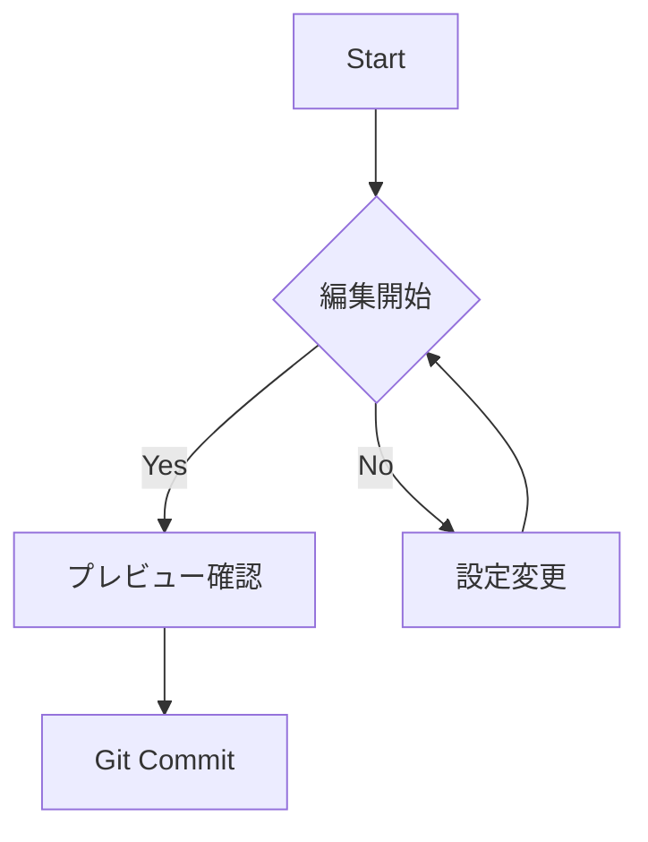

### 1. Notionライクな高機能テーブル
下の表はGUIで編集可能です。列の境界線をドラッグして幅を変えたり、**右クリック**から行・列を追加できます。

<!-- table-widths: [null,null,null] -->
| 機能名              | 説明               | 状態         |
| ---------------- | ---------------- | ---------- |
| **Live Preview** | マークダウン記法を即座に装飾   | Active     |
| **Table Editor** | ドラッグ&ドロップで列移動が可能 | Active     |
| **Git Client**   | コミット、プッシュ、履歴表示   | Integrated |

### 2. コード実行
JS, Python, Bashなどのコードブロックには「▶ Run」ボタンが表示され、エディタ内で実行結果を確認できます。

```javascript
// 右上の「▶ Run」ボタンを押してみてください
const greeting = "Hello, Markdown IDE!";
console.log(greeting);
console.log("現在時刻: " + new Date().toLocaleString());
```

---

### 3. ダイアグラム (Mermaid)
コードブロックを書くだけで、フローチャートやシーケンス図をリアルタイムに描画します。




<div class="page-break"></div>

### 4. 数式 (KaTeX)
美しい数式レンダリングをサポートしています。

$$
f(x) = \int_{-\infty}^\infty \hat f(\xi)\,e^{2\pi i \xi x} \,d\xi
$$

## 効率的なワークフロー

* **サイドバー**: `Ctrl+Shift+B` でファイルツリー、Git、アウトライン、検索を切り替え。
* **統合ターミナル**: `Ctrl+@` でターミナルを表示し、npmコマンドなどを実行できます。
* **コマンドパレット**: `Ctrl+Shift+P` で「PDFエクスポート」や「テーマ変更」など全ての機能にアクセスできます。

