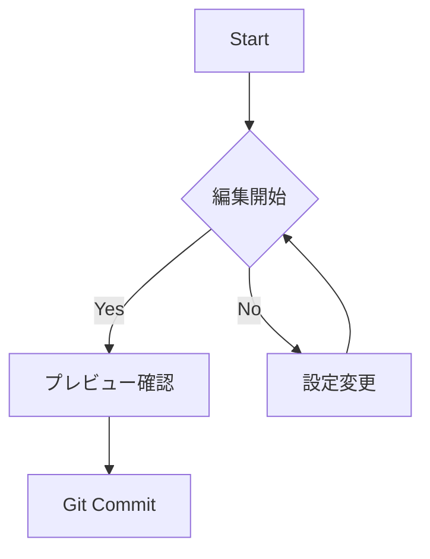

### 1. Notionライクな高機能テーブル
下の表はGUIで編集可能です。列の境界線をドラッグして幅を変えたり、**右クリック**から行・列を追加できます。

<!-- table-widths: [97,299,90,100] -->
| **Live Preview** | マークダウン記法を即座に装飾 | Active     |     |
| ---------------- | -------------- | ---------- | --- |
|                  |                |            |     |
| **Git Client**   | コミット、プッシュ、履歴表示 | Integrated |     |
|                  |                |            |     |

<br>

### 2. コード実行
JS, Python, Bashなどのコードブロックには「▶ Run」ボタンが表示され、エディタ内で実行結果を確認できます。

```python
print("Hello, World!")
```

---

### 3. ダイアグラム (Mermaid)
他のエディタではできないMermaidのフローチャートとMermaidのコード自体を両方表示できるようにしました。



